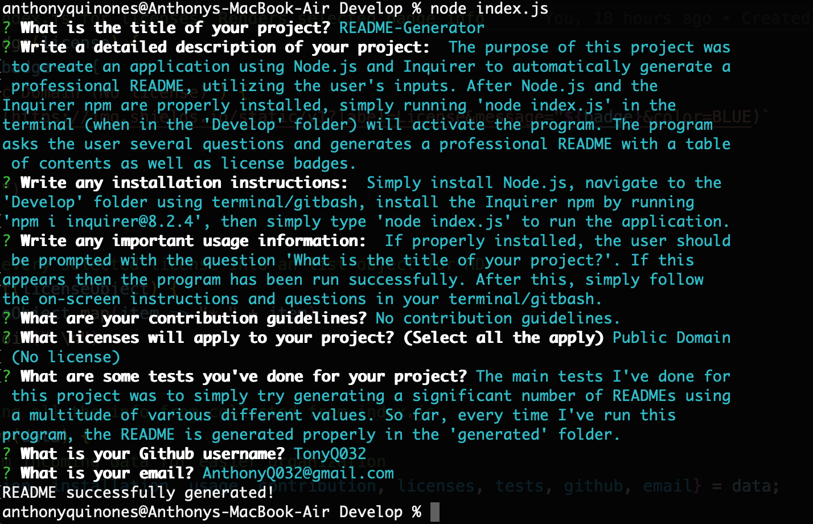

# README-Generator
A professional README generator powered by Node.js and Inquirer.

## Description
The purpose of this project was to create a command-line application using Node.js and Inquirer to automatically generate a professional README, utilizing the user's inputs. After Node.js and the Inquirer npm are properly installed, simply running 'node index.js' in terminal/gitbash (when in the 'Develop' folder) will activate the program. The program asks the user several questions and generates a professional README with a table of contents as well as license badges.

The vast majority of this README was generated using the program with only a few minor changes done manually.

## Table of Contents
* [Installation](#installation)
* [Usage](#usage)
* [Licenses](#licenses)
* [Contribution](#contribution)
* [Tests](#tests)
* [Demonstration](#demonstration)
* [Questions](#questions)

## Installation
Simply install Node.js, navigate to the 'Develop' folder using terminal/gitbash, install the Inquirer npm by running 'npm i inquirer@8.2.4', then simply type 'node index.js' to run the application.

## Usage
If properly installed, the user should be prompted with the question 'What is the title of your project?'. If this appears then the program has been run successfully. After this, simply follow the on-screen instructions and questions in your terminal/gitbash.

## Licenses
This project falls under the following license(s): 

* Public Domain (No license)

## Contribution
No contribution guidelines.

## Tests
The main tests I've done for this project was to simply try generating a significant number of READMEs using a multitude of various different values. So far, every time I've run this program, the README is generated properly in the 'generated' folder.

## Demonstration
Below is a screenshot of the program running inside a MacOS Terminal.

A video demonstration of the program being run is also available [here.](https://drive.google.com/file/d/1E-n0S4yLhyfm45o6ir5Yud3Hk3sMM3_9/view)

## Questions
If you have any questions, please contact me below: 

Github: [TonyQ032](https://github.com/TonyQ032) 

Email: AnthonyQ032@gmail.com
